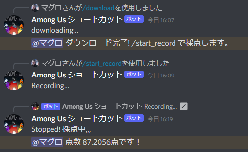

# remote-karaoke
Discord上でカラオケを行うbot

# 概要
youtube-dlで音源を用意、Discordのボイスチャンネルで録音。
DTWで採点。

# 注意点
このbotはカラオケ音源を用意するためyoutube_dlを使用しています。<br>
違法性はないと判断されていますが、Google社はコンテンツのスクレイピングを全面的に禁止しているので、使用すると**罪に問われる可能性**があります。<br>
上記のことに関しては責任を負いかねますのでご了承ください。<br>

# 使い方
auth.jsonにDiscord Botのトークンを入れます。
```bash
{
    "token" : "ここにDiscord Botのトークンを入れる"
}
```
スラッシュコマンドを使用します。
```bash
# 音源ダウンロード
/download url
# 採点スタート
/start_record
# 中断
/stop_recording
```


# 使うライブラリ
環境 Python 3.8.6 64-bit <br>
ffmpeg <https://ffmpeg.org/download.html>(main.pyと同じ階層に入れるか、環境変数にパスを通して利用してください)<br>
***必ずdiscord.pyをインストールした後にpycordをインストールしてください。***

```bash
pip install discord
pip install git+https://github.com/Pycord-Development/pycord
pip install ffmpeg-python
pip install librosa
pip install numpy
pip install pydub
pip install youtube_dl
```